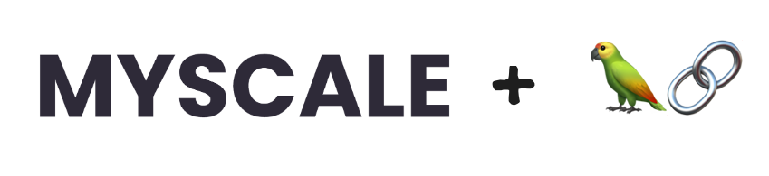

# ChatData 🔍 📖
***We are constantly improving LangChain's self-query retriever. Some of the features are not merged yet.***

[](https://discord.gg/D2qpkqc4Jq)
[](https://twitter.com/myscaledb)
<a href="https://huggingface.co/spaces/myscale/ChatData"  style="padding-left: 0.5rem;"></a>

<br>
<div style="text-align: center">

</div>

Yet another chat-with-documents app, but supporting query over millions of files with [MyScale](https://myscale.com) and [LangChain](https://github.com/hwchase17/langchain/).

## Introduction 📖

### Overview

ChatData is a robust chat-with-documents application designed to extract information and provide answers by querying the MyScalefree knowledge base or your uploaded documents.

Powered by the Retrieval Augmented Generation (RAG) framework, ChatData leverages millions of Wikipedia pages and arXiv papers as its external knowledge base, with MyScale managing all data hosting tasks. Simply input your questions in natural language, and ChatData takes care of generating SQL, querying the data, and presenting the results.

Enhancing your chat experience, ChatData introduces three key features. Let's delve into each of them in detail.

#### Feature 1: Retriever Type

MyScale works closely with LangChain, providing the easiest interface to build complex queries with LLM.

**Self-querying retriever:** MyScale augmented LangChain's Self Querying Retriever, where the LLM can use more data types, for instance timestamps and array of strings, to build filters for the query.

**VectorSQL:** SQL is powerful and can be used to construct complex search queries. Vector Structured Query Language (Vector SQL) is designed to teach LLMs how to query SQL vector databases. Besides the general data types and functions, vectorSQL contains extra functions like DISTANCE(column, query_vector)and NeuralArray(entity), with which we can extend the standard SQL for vector search.

#### Feature 2: Session Management

To enhance your experience and seamlessly continue interactions with existing sessions, ChatData has introduced the Session Management feature. You can easily customize your session ID and modify your prompt to guide ChatData in addressing your queries. With just a few clicks, you can enjoy smooth and personalized session interactions.

#### Feature 3: Building Your Own Knowledge Base

In addition to tapping into ChatData's external knowledge base powered by MyScale for answers, you also have the option to upload your own files and establish a personalized knowledge base. We've implemented the Unstructured API for this purpose, ensuring that only processed texts from your documents are stored, prioritizing your data privacy.

In conclusion, with ChatData, you can effortlessly navigate through vast amounts of data, effortlessly accessing precisely what you need. Whether you're a researcher, a student, or a knowledge enthusiast, ChatData empowers you to explore academic papers and research documents like never before. Unlock the true potential of information retrieval with ChatData and discover a world of knowledge at your fingertips. 

➡️ Dive in and experience ChatData on [Hugging Face](https://huggingface.co/spaces/myscale/ChatData)🤗


### Data schema

Database credentials:

```toml
MYSCALE_HOST = "msc-4a9e710a.us-east-1.aws.staging.myscale.cloud"
MYSCALE_PORT = 443
MYSCALE_USER = "chatdata"
MYSCALE_PASSWORD = "myscale_rocks"
```

#### *[NEW]* Table `wiki.Wikipedia`

ChatData also provides you access to Wikipedia, a large knowledge base that contains about 36 million paragraphs under 5 million wiki pages. The knowledge base is a snapshot on 2022-12.

You can query from this table with the public account [here](#data-schema).

```sql
CREATE TABLE wiki.Wikipedia (
    -- Record ID
    `id` String, 
    -- Page title to this paragraph
    `title` String, 
    -- Paragraph text
    `text` String,
    -- Page URL
    `url` String,
    -- Wiki page ID
    `wiki_id` UInt64,
    -- View statistics
    `views` Float32,
    -- Paragraph ID
    `paragraph_id` UInt64,
    -- Language ID
    `langs` UInt32, 
    -- Feature vector to this paragraph
    `emb` Array(Float32), 
    -- Vector Index
    VECTOR INDEX emb_idx emb TYPE MSTG('metric_type=Cosine'), 
    CONSTRAINT emb_len CHECK length(emb) = 768) 
ENGINE = ReplacingMergeTree ORDER BY id SETTINGS index_granularity = 8192
```

#### Table `default.ChatArXiv`

ChatData brings millions of papers into your knowledge base. We imported 2.2 million papers with metadata info, which contains:

1. `id`: paper's arxiv id
2. `abstract`: paper's abstracts used as ranking criterion (with InstructXL)
3. `vector`: column that contains the vector array in `Array(Float32)`
4. `metadata`: LangChain VectorStore Compatible Columns
    1. `metadata.authors`: paper's authors in *list of strings*
    2. `metadata.abstract`: paper's abstracts used as ranking criterion (with InstructXL)
    3. `metadata.titles`: papers's titles
    4. `metadata.categories`: paper's categories in *list of strings* like ["cs.CV"]
    5. `metadata.pubdate`: paper's date of publication in *ISO 8601 formated strings*
    6. `metadata.primary_category`: paper's primary category in *strings* defined by arXiv
    7. `metadata.comment`: some additional comment to the paper
  
*Columns below are native columns in MyScale and can only be used as SQLDatabase*

5. `authors`: paper's authors in *list of strings*
6. `titles`: papers's titles
7. `categories`: paper's categories in *list of strings* like ["cs.CV"]
8. `pubdate`: paper's date of publication in *Date32 data type* (faster)
9. `primary_category`: paper's primary category in *strings* defined by arXiv
10. `comment`: some additional comment to the paper

And for overall table schema, please refer to [table creation section in docs/self-query.md](docs/self-query.md#table-creation).

If you want to use this database with `langchain.chains.sql_database.base.SQLDatabaseChain` or `langchain.retrievers.SQLDatabaseRetriever`, please follow guides on [data preparation section](docs/vector-sql.md#prepare-the-database) and [chain creation section](docs/vector-sql.md#create-the-sqldatabasechain) in docs/vector-sql.md

### How to run ChatData

<a name="how-to-run"></a>

```bash
python3 -m pip install requirements.txt
python3 -m streamlit run app.py
```

### Where can I get those arXiv data?
  - [From parquet files on S3](docs/self-query.md#insert-data)
  - <a name="data-service"></a>Or Directly use MyScale database as service... for **FREE** ✨
    ```python
    import clickhouse_connect

    client = clickhouse_connect.get_client(
        host='msc-4a9e710a.us-east-1.aws.staging.myscale.cloud',
        port=443,
        username='chatdata',
        password='myscale_rocks'
    )
    ```

## Monthly Updates 🔥 (November-2023)

- 🚀 Upload your documents and chat with your own knowledge bases with MyScale!
- 💬 Chat with RAG-enabled agents on both ArXiv and Wikipedia knowledge base!
- 📖 Wikipedia is available as knowledge base!! Feel FREE 💰 to ask with 36 million of paragraphs under 5 million titles! 💫
- 🤖 LLMs are now capable of writing **Vector SQL** - a extended SQL with vector search! Vector SQL allows you to **access MyScale faster and stronger**! This will **be added to LangChain** soon! ([PR 7454](https://github.com/hwchase17/langchain/pull/7454))
- 🌏 Customized Retrieval QA Chain that gives you **more information** on each PDF and **answer question in your native language**!
- 🔧 Our contribution to LangChain that helps self-query retrievers [**filter with more types and functions**](https://python.langchain.com/docs/modules/data_connection/retrievers/how_to/self_query/myscale_self_query)
- 🌟 **We just opened a FREE pod hosting data for ArXiv paper.** Anyone can try their own SQL with vector search!!! Feel the power when SQL meets vector search! See how to access the pod [here](#data-service).
- 📚 We collected about **2 million papers on arxiv**! We are collecting more and we need your advice!
- More coming...

## How to build your own app from scratch 🧱

### Quickstart

1. Create an virtual environment

```bash
python3 -m venv .venv
source .venv/bin/activate
```

2. Install dependencies

> This app is currently using [MyScale's technical preview of LangChain](https://github.com/myscale/langchain/tree/preview). 
>> 
>> It contains improved SQLDatabaseChain in [this PR](https://github.com/hwchase17/langchain/pull/7454)
>> 
>> It contains [improved prompts](https://github.com/hwchase17/langchain/pull/6737#discussion_r1243527112) for comparators `LIKE` and `CONTAIN` in [MyScale self-query retriever](https://github.com/hwchase17/langchain/pull/6143).

```bash
python3 -m pip install -r requirements.txt
```

3. Run the app!

```python
# fill you OpenAI key in .streamlit/secrets.toml
cp .streamlit/secrets.example.toml .streamlit/secrets.toml
# start the app
python3 -m streamlit run app.py
```

### With LangChain SQLDatabaseRetrievers

 [*Read the full article*](https://blog.myscale.com/2023/07/17/teach-your-llm-vector-sql/)


- [Why Vector SQL?](https://blog.myscale.com/2023/07/17/teach-your-llm-vector-sql/#automate-the-whole-process-with-sql-and-vector-search)
- [How did LangChain and MyScale convert natural language to structured filters?](https://docs.myscale.com/en/advanced-applications/chatdata/#selfqueryretriever)
- [How to make chain execution more responsive in LangChain?](https://docs.myscale.com/en/advanced-applications/chatdata/#add-callbacks)

### With LangChain Self-Query Retrievers

[*Read the full article*](https://docs.myscale.com/en/advanced-applications/chatdata/#selfqueryretriever)

- [How this app is built?](https://docs.myscale.com/en/advanced-applications/chatdata)
- [What is the overview pipeline?](https://docs.myscale.com/en/advanced-applications/chatdata/#design-the-query-pipeline)
- [How did LangChain and MyScale convert natural language to structured filters?](https://docs.myscale.com/en/advanced-applications/chatdata/#selfqueryretriever)
- [How to make chain execution more responsive in LangChain?](https://docs.myscale.com/en/advanced-applications/chatdata/#add-callbacks)

## Community 🌍

- Welcome to join our #ChatData channel in [Discord](https://discord.gg/jGCq2yZH) to discuss anything about ChatData.
- Feel free to filing an issue or opening a PR against this repository.

## Special Thanks 👏 (Ordered Alphabetically)

- [arXiv API](https://info.arxiv.org/help/api/index.html) for its open access interoperability to pre-printed papers.
- [InstructorXL](https://huggingface.co/hkunlp/instructor-xl) for its promptable embeddings that improves retrieve performance.
- [LangChain🦜️🔗](https://github.com/hwchase17/langchain/) for its easy-to-use and composable API designs and prompts.
- [OpenChatPaper](https://github.com/liuyixin-louis/OpenChatPaper) for prompt design reference.
- [The Alexandria Index](https://alex.macrocosm.so/download) for providing arXiv data index to the public.
