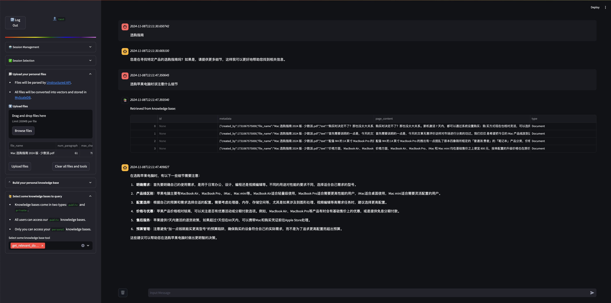

# ChatBot 🤖

## 简介

ChatBot 是 RAG 的一个具体实现案例，它能够解析并向量化存储用户的文档，从而为用户提供对这些文档的 RAG 检索服务。

## 本地部署流程

### Step1. 部署 MyScaleDB
我们推荐用户使用 docker compose 进行本地部署，详细的部署教程请参考 [MyScaleDB 官方文档](https://github.com/myscale/myscaledb?tab=readme-ov-file#using-docker-compose)

需要注意的是，如果你需要在机器 A 上访问在机器 B 部署的 MyScaleDB，那么就需要额外配置 MyScaleDB 的网络。
对于测试环境，你可以允许 MyScaleDB 接受来自所有的 ip 请求，下面是 MyScaleDB 的配置文件案例

`volumes/config/users.d/custom_users_config.xml`
```xml
<clickhouse>
  <users>
      <default>
          <password></password>
          <networks>
              <ip>::/0</ip>
              <ip>::1</ip>
              <ip>127.0.0.1</ip>
          </networks>
          <profile>default</profile>
          <quota>default</quota>
          <access_management>1</access_management>
      </default>
  </users>
</clickhouse>
```

### Step2. 本地部署 unstructured-api 文本解析服务
unstructured-api 是一个负责解析用户非结构化文档的服务，支持大部分常见的文件格式，如 .doc, .ppt, .pdf

下面提供了命令来快速部署 unstructured-api
```bash
docker run -p 9500:9500 -d --rm --name unstructured-api -e PORT=9500 downloads.unstructured.io/unstructured-io/unstructured-api:latest
```
如果你遇到了因为网络问题导致的下载模型缓慢或者超时，可以尝试在执行 docker run 命令时增加下面的参数:
```bash
--env HF_ENDPOINT=https://hf-mirror.com
```
关于 unstructured api 的更多部署内容，请参考[官方文档](https://github.com/Unstructured-IO/unstructured-api?tab=readme-ov-file#dizzy-instructions-for-using-the-docker-image)

### Step3. 本地运行 ChatBot
在运行 ChatBot 之前，我们首先需要配置环境变量，在目录 `app/.streamlit` 下复制一份环境变量配置文件
```bash
cp secretes.example.toml secrets.toml
```
接下来按照自己的服务部署情况填写相关配置，下面是一个实际的案例
```toml
MYSCALE_HOST = "<input your db host here>"
MYSCALE_PORT = 8123
MYSCALE_USER = "default"
MYSCALE_PASSWORD = ""
MYSCALE_ENABLE_HTTPS = false

OPENAI_API_BASE = "https://****api****/v1"
OPENAI_API_KEY = "sk-************"

UNSTRUCTURED_API_HOST = "<input your unstructured api host here>"
UNSTRUCTURED_API_PORT = "9500"
```

紧接着，可以安装 python 环境依赖，并运行 ChatBot

```bash
cd app/
python3 -m venv venv
source venv/bin/activate
python3 -m pip install -r requirements.txt
python3 -m streamlit run app.py
```

如果你想二次修改代码，并使得修改后的代码立刻反映到 ChatBot 服务上，可以执行
```bash
python3 -m streamlit run app.py --server.runOnSave=true
```

## 使用 RAG 服务



在本地部署成功之后，你可以网页最左侧可以看到工具栏，工具栏主要有以下几个功能：
- Session Management：可以理解为会话历史，可以在这里创建新的会话
- Session Selection：选择不同的会话上下文
- Upload your personal files：你可以上传本地文件，ChatBot 会解析并向量化这些内容
- Build your personal knowledge base：选择一组文件并创建一个知识库，建议知识库的名字使用英文命名
- Select some knowledge base to query：选择你刚刚创建的知识库，接下里就能够在网页右侧使用 RAG 检索
