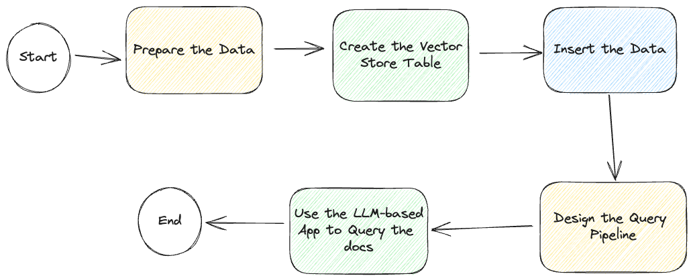
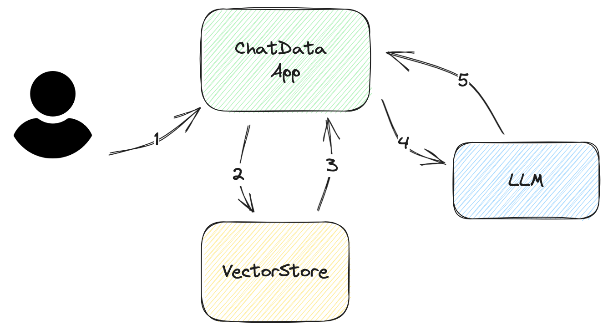
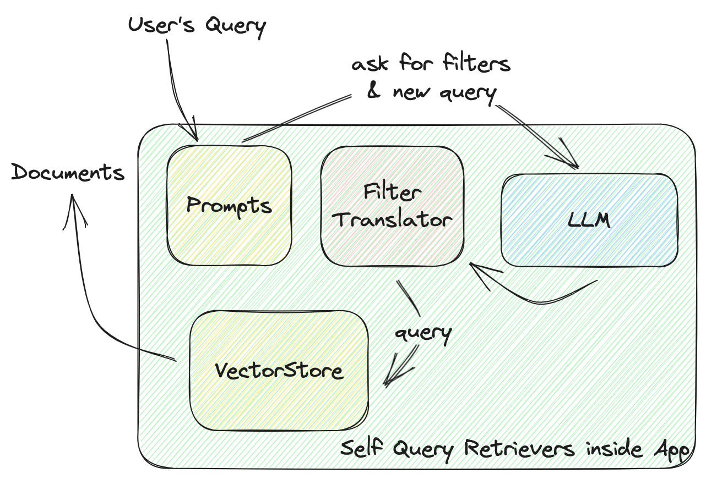
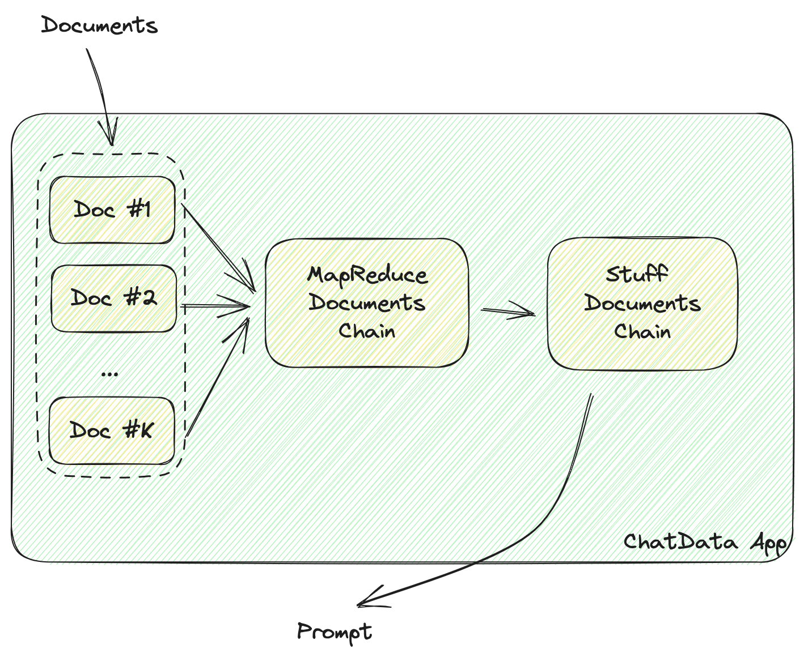

# HOW-TO: Build a ChatPDF App over millions of documents with LangChain and MyScale in 30 Minutes

Chatting with GPT about a single academic paper is relatively straightforward by providing the document as the language model context. Chatting with millions of research papers is also simple... as long as you choose the right vector database.

<br>
<div style="text-align: center">

</div>

Large language models (LLM) are powerful NLP tools. One of the most significant benefits of LLMs, such as ChatGPT, is that you can use them to build tools that allow you to interact (or chat) with documents, such as PDF copies of research or academic papers, based on their topics and content.

Many implementations of chat-with-document apps already exist, like [ChatPaper](https://github.com/kaixindelele/ChatPaper), [OpenChatPaper](https://github.com/liuyixin-louis/OpenChatPaper), and [DocsMind](https://github.com/3Alan/DocsMind). But, many of these implementations seem complicated, with simplistic search utilities only featuring elementary keyword searches filtering on basic metadata such as year and subject.

Therefore, developing a ChatPDF-like app to interact with millions of academic/research papers makes sense. You can chat with the data in your natural language, combining both semantic and structural attributes, asking questions such as "What is a neural network?" and providing additional qualifiers like "Please use articles published by Geoffrey Hinton after 2018."

The primary purpose of this article is to help you build your own ChatPDF app that allows you to interact (chat) with millions of academic/research papers using LangChain and MyScale.

> This app should take about 30 minutes to create.

But before we start, let’s look at the following diagrammatic workflow of the whole process:

<br>
<div style="text-align: center">

</div>

> Even though we describe how to develop this LLM-based chat app, we have a sample app on [GitHub](https://github.com/myscale/ChatData), including access to a [read-only vector database](../app/.streamlit/secrets.example.toml), further simplifying the app-creation process.

## Prepare the Data

As described in this image, the first step is to prepare the data.

> We recommend you to use our open database for this app. The credentials are in the example configuration: `$PROJECT_DIR/app/.streamlit/secrets.toml`. Or you can follow the instruction below to create your own database.  It takes about 20 minutes to create the database.

We have sourced our data: a usable list of abstracts and arXiv IDs from the Alexandria Index through the [Macrocosm website](https://alex.macrocosm.so/). Using this data and interrogating the arXiv Open API, we can significantly enhance the query experience by retrieving a much richer set of metadata, including year, subject, release date, category, and author.

> We have prepared the data using the [arXiv Open API](https://info.arxiv.org/help/api/index.html) to simplify the app-creation process.

Now that we have the data, let's dive into the next steps:

## Create the Table

The first step is to create a table schema. Sign into [myscale.com](http://myscale.com/) and create a free [cluster](http://console.myscale.com/).

After creating the cluster, the next step is to create a table that is compatible with our MyScale VectorStore.

> There will be a workspace sidebar on your left. This is the place where you can play with pure SQL.

Use the following script to create a MyScale VectorStore table:

```sql
CREATE TABLE default.langchain (
    `abstract` String,
    `id` String,
    `vector` Array(Float32),
    `metadata` Object('JSON'),
    CONSTRAINT vec_len CHECK length(vector) = 768)
ENGINE = ReplacingMergeTree ORDER BY id
```

You can also create a table initializing a MyScale VectorStore in LangChain with Python, as the following code sample describes:

```python
from langchain.vectorstores import MyScale, MyScaleSettings
config = MyScaleSetting(host="<your-backend-url>", port=8443, ...)
doc_search = MyScale(embedding_function, config)
```

Both these methods do the same job.

Great. Let’s move onto the next step.

## Insert the Data

> We have appended additional metadata, like the publication date and authors, to each ArXiv entry.

Our data is hosted on [Amazon S3](https://docs.aws.amazon.com/AmazonS3/latest/userguide/Welcome.html), supported by [Clickhouse table functions](https://clickhouse.com/docs/en/sql-reference/table-functions/s3).
The compressed `jsonl` file is available [here](https://myscale-demo.s3.ap-southeast-1.amazonaws.com/chat_arxiv/full.json.zst). You can also import data via partitioned dataset (113 parts) from our AWS S3 bucket (the URL will look like `https://myscale-demo.s3.ap-southeast-1.amazonaws.com/chat_arxiv/data.part*.0.jsonl.zst`) to your MyScale Cloud with [S3 table function](https://clickhouse.com/docs/en/sql-reference/table-functions/s3).

> You can also upload the data onto Google Cloud Platform and use the same SQL insert query to import this data.

To insert data into this table, you still have the same options as when creating a VectorStore table: MyScale SQL workspace or LangChain.

### MyScale SQL Workspace

Paste the following SQL statement into the MyScale SQL workspace and click **Run**:

```sql
INSERT INTO langchain
SELECT
  *
FROM
  s3(
    'https://myscale-demo.s3.ap-southeast-1.amazonaws.com/chat_arxiv/data.*.jsonl.zst',
    'JSONEachRow',
    'abstract String, id String, vector Array(Float32), metadata Object(''JSON'')',
    'zstd'
  )
```

Then you need to build the vector index with this SQL:

```sql
ALTER TABLE langchain ADD VECTOR INDEX vec_idx vector TYPE MSTG('metric_type=Cosine')
```

### LangChain

The second option is to insert the data into the table using LangChain for better control over the data insertion process.

Add the following code snippet to your app’s code:

```python
# ! unzstd data-*.jsonl.zst
import json
from langchain.docstore.document import Document

def str2doc(_str):
    j = json.loads(_str)
    return Document(page_content=j['abstract'], metadata=j['metadata'])

with open('func_call_data.jsonl') as f:
    docs = [str2doc(l) for l in f.readlines()]
```

## Design the Query Pipeline

Most LLM-based applications need an automated pipeline for querying and returning an answer to the query.

> Chat-with-LLM apps must generally retrieve reference documents before querying their models (LLMs).

Let's look at the step-by-step workflow describing how the app answers the user's queries, as illustrated in the following diagram:

<br>
<div style="text-align: center">

</div>

1. **Ask for the user's input/questions.**
   This input must be as concise as possible. In most cases, it should be at most several sentences.

2. **Construct a DB query from the user's input.**
   The query is simple for vector databases. All you need to do is to extract the relevant embedding from the vector database. However, for enhanced accuracy, it is advisable to filter your query.

   For instance, let's assume the user only wants the latest papers rather than all the papers in the returned embedding, but the returned embedding includes all the research papers. By way of solving this challenge, you can add metadata filters to the query to filter out the correct information.

3. **Parse the retrieved documents from VectorStore.**
   The data returned from the vector store is not in a native format that the LLM understands. You must parse it and insert it into your prompt templates. Sometimes you need to add more metadata to these templates, like the date created, authors, or document categories. This metadata will help LLM improve the quality of its answer.

4. **Ask the LLM.**
   This process is straightforward as long as you are familiar with the LLM's API and have properly designed prompts.

5. **Fetch the answer**
  Returning the answer is straightforward for simple applications. But, if the question is complex, additional effort is required to provide more information to the user; for example, adding the LLM's source data. Additionally, adding reference numbers to the prompt can help you find the source and reduce your prompt's size by avoiding repeating content, such as the document's title.

In practice, LangChain has a good framework to work with. We used the following functions to build this pipeline:

* `RetrievalQAWithSourcesChain`
* `SelfQueryRetriever`

### `SelfQueryRetriever`

This function defines the interaction between the VectorStore and your app. Let’s dive deeper into how a self-query retriever works, as illustrated in the following diagram:

<br>
<div style="text-align: center">

</div>

LangChain’s `SelfQueryRetriever` defines a universal filter for every VectorStore, including several `comparators` for comparing values and `operators`, combining these conditions to form a filter. The LLM will generate a filter rule based on these `comparators` and `operators`. All VectorStore providers will implement a `FilterTranslator` to translate the given universal filter to the correct arguments that call the VectorStore.

LangChain's universal solution provides a complete package for new operators, comparators, and vector store providers. However, you are limited to the pre-defined elements inside it.

<!-- > Why don't you try and build a prompt filter yourself? This will help you eliminate LangChain's default filter translator, allowing you to implement customized filter comparisons. -->

In the prompt filter context, MyScale includes more powerful and flexible filters. We have added more data types, like lists and timestamps, and more functions, like string pattern matching and `CONTAIN` comparators for lists, offering more options for data storage and query design.

> We contributed to LangChain's Self-Query retrievers to make them more powerful, resulting in self-query retrievers that provide more freedom to the LLM when designing the query.

Look at [what else MyScale can do with metadata filters](https://myscale.com/blog/why-integrated-database-solution-can-boost-your-llm-apps/#filter-on-anything-without-constraints).

Here is the code for it, written using LangChain:

```python
from langchain.vectorstores import MyScale
from langchain.embeddings import HuggingFaceInstructEmbeddings

# Assuming you data is ready on MyScale Cloud
embeddings = HuggingFaceInstructEmbeddings()
doc_search = MyScale(embeddings)

# Define metadata fields and their types
# Descriptions are important. That's where LLM know how to use that metadata.
metadata_field_info=[
    AttributeInfo(
        name="pubdate",
        description="The year the paper is published",
        type="timestamp",
    ),
    AttributeInfo(
        name="authors",
        description="List of author names",
        type="list[string]",
    ),
    AttributeInfo(
        name="title",
        description="Title of the paper",
        type="string",
    ),
    AttributeInfo(
        name="categories",
        description="arxiv categories to this paper",
        type="list[string]"
    ),
    AttributeInfo(
        name="length(categories)",
        description="length of arxiv categories to this paper",
        type="int"
    ),
]

# Now build a retriever with LLM, a vector store and your metadata info
retriever = SelfQueryRetriever.from_llm(
    OpenAI(openai_api_key=st.secrets['OPENAI_API_KEY'], temperature=0),
    doc_search, "Scientific papers indexes with abstracts", metadata_field_info,
    use_original_query=True)
```

### `RetrievalQAWithSourcesChain`

This function constructs the prompts containing the documents.

Data should be formatted into LLM readable strings, like JSON or Markdown that contain the document’s info in it.

<br>
<div style="text-align: center">

</div>

As highlighted above, once the document data has been retrieved from the vector store, it must be formatted into LLM-readable strings, like JSON or Markdown.

LangChain uses the following chains to build these LLM-readable strings:

* `MapReduceDocumentsChain`
* `StuffDocumentsChain`

`MapReduceDocumentChain` gathers all the documents the vector store returns and normalizes them into a standard format. It maps the documents to a prompt template and concatenates them together. `StuffDocumentChain` works on those formatted documents, inserting them as context with task descriptions as prefixes and examples as suffixes.

Add the following code snippet to your app’s code so that your app will format the vector store data into LLM-readable documents.

```python
chain = RetrievalQAWithSourcesChain.from_llm(
        llm=OpenAI(openai_api_key=st.secrets['OPENAI_API_KEY'], temperature=0.
        retriever=retriever,
        return_source_documents=True,)
```

## Run the Chain

With these components, we can now search and answer the user's questions with a scalable vector store.

Try it yourself!

```python
ret = st.session_state.chain(st.session_state.query, callbacks=[callback])
# You can find the answer from LLM in the field `answer`
st.markdown(f"### Answer from LLM\n{ret['answer']}\n### References")
# and source documents in `sources` and `source_documents`
docs = ret['source_documents']
```

Not responsive?

### Add Callbacks

The chain works just fine, but you might have a complaint: It needs to be faster!

Yes, the chain will be slow as it will construct a filtered vector query (one LLM call), retrieve data from VectorStore and ask LLM (another LLM call). Consequently, the total execution time will be about 10~20 seconds.

Don't worry; LangChain has your back. It includes [Callbacks](https://python.langchain.com/en/latest/modules/callbacks/getting_started.html?highlight=Callbacks) that you can use to increase your app's responsiveness. In our example, we added several callback functions to update a progress bar:

```python
class ChatArXivAskCallBackHandler(StreamlitCallbackHandler):
    def __init__(self) -> None:
        # You will have a progress bar when this callback is initialized
        self.progress_bar = st.progress(value=0.0, text='Searching DB...')
        self.status_bar = st.empty()
        self.prog_value = 0.0
        # You can use chain names to control the progress
        self.prog_map = {
            'langchain.chains.qa_with_sources.retrieval.RetrievalQAWithSourcesChain': 0.2,
            'langchain.chains.combine_documents.map_reduce.MapReduceDocumentsChain': 0.4,
            'langchain.chains.combine_documents.stuff.StuffDocumentsChain': 0.8
        }

    def on_llm_start(self, serialized, prompts, **kwargs) -> None:
        pass

    def on_text(self, text: str, **kwargs) -> None:
        pass

    def on_chain_start(self, serialized, inputs, **kwargs) -> None:
        # the name is in list, so you can join them in strings.
        cid = '.'.join(serialized['id'])
        if cid != 'langchain.chains.llm.LLMChain':
            self.progress_bar.progress(value=self.prog_map[cid], text=f'Running Chain `{cid}`...')
            self.prog_value = self.prog_map[cid]
        else:
            self.prog_value += 0.1
            self.progress_bar.progress(value=self.prog_value, text=f'Running Chain `{cid}`...')

    def on_chain_end(self, outputs, **kwargs) -> None:
        pass
```

Now your app will have a pretty progress bar just like ours.

<br>
<div style="text-align: center">

</div>

## In Conclusion

This is how an LLM app should be built with LangChain!

Today we provided a brief overview of how to build a simple LLM app that chats with the MyScale VectorStore, and also explained how to use chains in the query pipeline.

We hope this article helps you when you design your LLM-based app architecture from the ground up.

You can also ask for help on our [Discord server](https://discord.gg/D2qpkqc4Jq). We are happy to help, whether on vector databases, LLM apps, or other fantastic stuff. You are also welcomed to use our open database to build your own apps! We believe you can more awesome apps with this self-query retriever with MyScale! Happy Coding!

See you in the following article!
