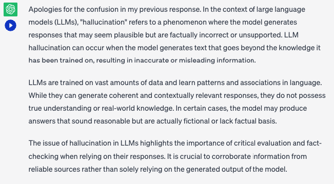
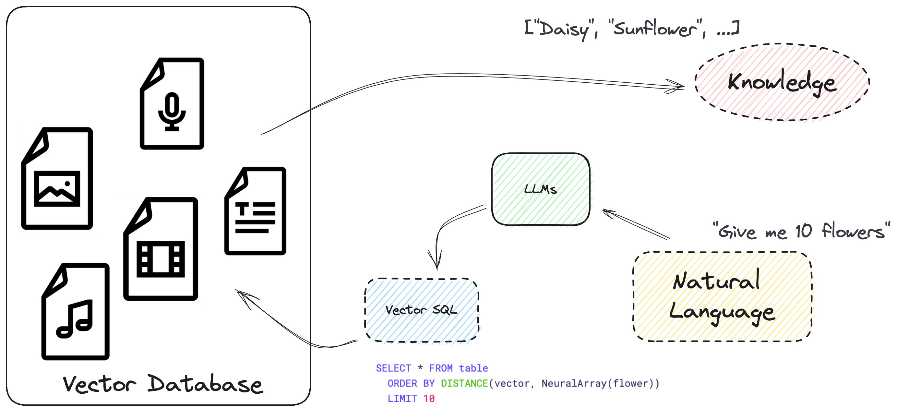
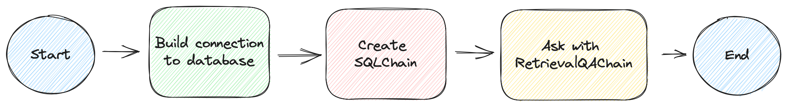

# Teach Your LLM to Seach Using Vector SQL and Answer With Facts From Database

A vector database that supports Structured Query Language can store more than vectors. Common data types like timestamps and arrays can be accessed and filtered within the database, which improves the accuracy and efficiency of vector search queries. Accurate results from the database can teach LLMs to speak with facts, which reduces hallucination and enhance the quality and credibility of answers from LLM.

## What is Hallucination?

Large Language Models are advanced AI systems that can answer a wide range of questions. Although they provide informative responses on topics they know, they are not always accurate on unfamiliar topics. This phenomenon is known as **hallucination**.

Before we look at an example of an LLM hallucination, let's consider a definition of the term "hallucination" as described by [Wikipedia.com](https://en.wikipedia.org/wiki/Hallucination): 

> "A hallucination is a perception in the absence of an external stimulus that has the qualities of a real perception."

Moreover: 

> "Hallucinations are vivid, substantial, and are perceived to be located in external objective space."

In other words, a hallucination is an error in (or a false) perception of something real or concrete. For example, a Large Language Model was asked what LLM hallucinations are, with the answer being: 

](../assets/hallucination.png)

Therefore, the question begs, how do we improve on (or fix) this result? The concise answer is to add facts to your question, such as providing the LLM definition before or after you ask the question. 

For instance: 

>  An LLM is a Large Language Model, an artificial neural network that models how humans talk and write. Please tell me, what is LLM hallucination?

The public domain answer to this question, provided by ChatGPT, is: 



**Note:** The reason for the first sentence, "Apologies for the confusion in my earlier response," is that we asked ChatGPT our first question, what LLM hallucinations are, before giving it our second prompt: "An LLM..."

These additions have improved the quality of the answer. At least it no longer thinks an LLM hallucination is a "Late-Life Migraine Accompaniment!" 😆 

## External Knowledge Reduces Hallucinations

At this juncture, it is absolutely crucial to note that an LLM is not infallible nor the ultimate authority on all knowledge. LLMs are trained on large amounts of data and learn patterns in language, but they may not always have access to the most up-to-date information or have a comprehensive understanding of complex topics.

What now? How do you increase the chance of reducing LLM hallucinations? 

The solution to this problem is to include supporting documents to the query (or prompt) to guide the LLM toward a more accurate and informed response. Like humans, it needs to learn from these documents to answer your question accurately and correctly.

Helpful documents can come from many sources, including a search engine like Google or Bing and a digital library like Arxiv, among others, providing an interface to search for relevant passages. Using a database is also a good choice, providing a more flexible and private query interface.

Knowledge retrieved from sources must be relevant to the question/prompt. There are several ways to retrieve relevant documents, including: 

* **Keyword-based:** Searching for keywords in plain text, suitable for an exact match on terms.
* **Vector search-based:** Searching for records closer to embeddings, helpful in searching for appropriate paraphrases or general documents.

Nowadays, vector searches are popular since they can solve paraphrase problems and calculate paragraph meanings. Vector search is not a one-size-fits-all solution; it should be paired with specific filters to maintain its performance, especially when searching massive volumes of records. For example, should you only want to retrieve knowledge about physics (as a subject), you must filter out all information about any other subjects. Thus, the LLM will not be confused by knowledge from other disciplines.

## Automate the Whole Process with SQL... and Vector Search

The LLM should also learn to query data from its data sources before answering the questions, automating the whole process. Actually, LLMs are already capable of writing SQL queries and following instructions.



SQL is powerful and can be used to construct complex search queries. It supports many different data types and functions. And it allows us to write a vector search in SQL with `ORDER BY` and `LIMIT`, treating the similarity score between embeddings as a column `distance`. Pretty straightforward, isn't it? 

> See the next section, [What Vector SQL Looks Like](#what-vector-sql-looks-like), for more information on structuring a vector SQL query.

There are significant benefits to using vector SQL to build complex search queries, including: 

* Increased flexibility for data type and function support
* Improved efficiency because SQL is highly optimized and executed inside the database
* Is human-readable and easy to learn as it is an extension of standard SQL
* Is LLM-friendly

**Note:** Many SQL examples and tutorials are available on the Internet. LLMs are familiar with standard SQL as well as some of its dialects.

Apart from MyScale, many SQL database solutions like Clickhouse and PostgreSQL are adding vector search to their existing functionality, allowing users to use vector SQL and LLMs to answer questions on complex topics. Similarly, an increasing number of application developers are starting to integrate vector searches with SQL into their applications. 

## What Vector SQL Looks Like

Vector Structured Query Language (Vector SQL) is designed to teach LLMs how to query vector SQL databases and contains the following extra functions:

* `DISTANCE(column, query_vector)`: This function compares the distance between the column of vectors and the query vector either exactly or approximately.
* `NeuralArray(entity)`: This function converts an entity (for example, an image or a piece of text) into an embedding.

With these two functions, we can extend the standard SQL for vector search. For example, if you want to search for 10 relevant records to word `flower`, you can use the following SQL statement:

```sql
SELECT * FROM table 
ORDER BY DISTANCE(vector, NeuralArray(flower))
LIMIT 10
```

The `DISTANCE` function comprises the following: 

* The inner function, `NeuralArray(flower)`, converts the word `flower` into an embedding. 
* This embedding is then serialized and injected into the `DISTANCE` function. 

Vector SQL is an extended version of SQL that needs further translation based on the vector database used. For instance, many implementations have different names for the `DISTANCE` function. It is called `distance` in MyScale, and `L2Distance` or `CosineDistance` in Clickhouse. Additionally, based on the database, this function name will be translated differently. 

## How to teach an LLM to write Vector SQL

Now that we understand the basic principles of vector SQL and its unique functions, let's use an LLM to help us to write a vector SQL query.

### 1. Teach an LLM What Standard Vector SQL is

First, we need to teach our LLM what standard vector SQL is. We aim to ensure that the LLM will do the following three things spontaneously when writing a vector SQL query:

* Extract the keywords from our question/prompt. It could be an object, a concept, or a topic.
* Decide which column to use to perform the similarity search. It should always choose a vector column for similarity.
* Translate the rest of our question's constraints into valid SQL.

### 1. Design the LLM Prompt

Having determined exactly what information the LLM requires to construct a vector SQL query, we can design the prompt as follows:

```python
# Here is an example of a vector SQL prompt
_prompt = f"""
You are a {dialect} expert. Given an input question, first, create a syntactically correct MyScale query to run, look at the query results, and return the answer to the input question.
The {dialect} query has a vector distance function called `DISTANCE(column, array)` to compute relevance to the user's question and sort the feature array column by this relevance. 
When the query asks for {top_k} closest row, you must use this distance function to calculate the distance to the entity's array on the vector column and order by the distance to retrieve the relevant rows.

*NOTICE*: `DISTANCE(column, array)` only accepts an array column as its first argument and a `NeuralArray(entity)` as its second argument. You also need a user-defined function called `NeuralArray(entity)` to retrieve the entity's array. 
"""
```

This prompt should do its job. But the more examples you add, the better it will be, like using the following vector SQL-to-text pair as a prompt:

**The SQL table create statement:**

```sql
------ table schema ------
CREATE TABLE "ChatPaper" (
	abstract String, 
	id String, 
	vector Array(Float32), 
        categories Array(String), 
	pubdate DateTime, 
	title String, 
	authors Array(String), 
	primary_category String
) ENGINE = ReplicatedReplacingMergeTree()
 ORDER BY id
 PRIMARY KEY id
```

**The question and answer:**

```text
Question: What is PaperRank? What is the contribution of these works? Use papers with more than 2 categories.
SQLQuery: SELECT ChatPaper.title, ChatPaper.id, ChatPaper.authors FROM ChatPaper WHERE length(categories) > 2 ORDER BY DISTANCE(vector, NeuralArray(PaperRank contribution)) LIMIT {top_k}
```

The more relevant examples you add to your prompt, the more the LLM's process of building the correct vector SQL query will improve. 

Lastly, here are several extra tips to help you when designing your prompt:

* Cover all possible functions that might appear in any questions asked.
* Avoid monotonic questions.
* Alter the table schema, like adding/removing /modifying names and data types.
* Align the prompt's format.

## A Real-World Example: Using MyScale

Let's now build [**a real-world example**](https://huggingface.co/spaces/myscale/ChatData), set out in the following steps: 



### Prepare the Database

We have prepared a playground for you with more than 2 million papers ready to query. You can access this data by adding the following Python code to your app. 

```python
from sqlalchemy import create_engine
MYSCALE_HOST = "msc-1decbcc9.us-east-1.aws.staging.myscale.cloud"
MYSCALE_PORT = 443
MYSCALE_USER = "chatdata"
MYSCALE_PASSWORD = "myscale_rocks"

engine = create_engine(f'clickhouse://{MYSCALE_USER}:{MYSCALE_PASSWORD}@{MYSCALE_HOST}:{MYSCALE_PORT}/default?protocol=https')
```

If you like, you can skip the following steps, where we create the table and insert its data using the MyScale console, and jump to where we play with vector SQL and [create the `SQLDatabaseChain`](#create-sqldatabasechain) to query the database. 

**Create the database table:**

```sql
CREATE TABLE default.ChatArXiv (
    `abstract` String, 
    `id` String, 
    `vector` Array(Float32), 
    `metadata` Object('JSON'), 
    `pubdate` DateTime,
    `title` String,
    `categories` Array(String),
    `authors` Array(String), 
    `comment` String,
    `primary_category` String,
    CONSTRAINT vec_len CHECK length(vector) = 768) 
ENGINE = ReplacingMergeTree ORDER BY id SETTINGS index_granularity = 8192
```

**Insert the data:**

```sql
INSERT INTO ChatArXiv
SELECT
  abstract, id, vector, metadata,
  parseDateTimeBestEffort(JSONExtractString(toJSONString(metadata), 'pubdate')) AS pubdate,
  JSONExtractString(toJSONString(metadata), 'title') AS title,
  arrayMap(x->trim(BOTH '"' FROM x), JSONExtractArrayRaw(toJSONString(metadata), 'categories')) AS categories,
  arrayMap(x->trim(BOTH '"' FROM x), JSONExtractArrayRaw(toJSONString(metadata), 'authors')) AS authors,
  JSONExtractString(toJSONString(metadata), 'comment') AS comment,
  JSONExtractString(toJSONString(metadata), 'primary_category') AS primary_category
FROM
  s3(
    'https://myscale-demo.s3.ap-southeast-1.amazonaws.com/chat_arxiv/data.part*.zst',
    'JSONEachRow',
    'abstract String, id String, vector Array(Float32), metadata Object(''JSON'')',
    'zstd'
  );
ALTER TABLE ChatArXiv ADD VECTOR INDEX vec_idx vector TYPE MSTG('metric_type=Cosine');
```

### Create the `SQLDatabaseChain`

This LangChain feature is currently under [MyScale tech preview](https://github.com/myscale/langchain/tree/preview). You can install it by executing the following installation script:

```bash
python3 -m venv .venv
source .venv/bin/activate
# This is a technical preview of langchain from MyScale
pip3 install langchain@git+https://github.com/myscale/langchain.git@preview
```

Once you have installed this feature, the next step is to use it to query the database, as the following Python code demonstrates: 

```python
from sqlalchemy import create_engine
MYSCALE_HOST = "msc-1decbcc9.us-east-1.aws.staging.myscale.cloud"
MYSCALE_PORT = 443
MYSCALE_USER = "chatdata"
MYSCALE_PASSWORD = "myscale_rocks"

# create connection to database
engine = create_engine(f'clickhouse://{MYSCALE_USER}:{MYSCALE_PASSWORD}@{MYSCALE_HOST}:{MYSCALE_PORT}/default?protocol=https')

from langchain.embeddings import HuggingFaceInstructEmbeddings
from langchain.callbacks import StdOutCallbackHandler
from langchain.chains.sql_database.parser import VectorSQLRetrieveAllOutputParser
from langchain.sql_database import SQLDatabase
from langchain.chains.sql_database.prompt import MYSCALE_PROMPT
from langchain.llms import OpenAI
from langchain.chains.sql_database.base import SQLDatabaseChain

# this parser converts `NeuralArray()` into embeddings
output_parser = VectorSQLRetrieveAllOutputParser(
    model=HuggingFaceInstructEmbeddings(model_name='hkunlp/instructor-xl')
)

# use the prompt above
PROMPT = PromptTemplate(
    input_variables=["input", "table_info", "top_k"],
    template=_prompt,
)

# bind the metadata to SqlAlchemy engine
metadata = MetaData(bind=engine)

# create SQLDatabaseChain
query_chain = SQLDatabaseChain.from_llm(
    # GPT-3.5 generates valid SQL better
    llm=OpenAI(openai_api_key=OPENAI_API_KEY, temperature=0), 
    # use the predefined prompt, change it to your own prompt
    prompt=MYSCALE_PROMPT, 
    # returns top 10 relevant documents
    top_k=10,
    # use result directly from DB
    return_direct=True,
    # use our database for retreival
    db=SQLDatabase(engine, None, metadata),
    # convert `NeuralArray()` into embeddings
    sql_cmd_parser=output_parser)

# launch the chain!! And trace all chain calls in standard output
query_chain.run("Introduce some papers that uses Generative Adversarial Networks published around 2019.", 
                callbacks=[StdOutCallbackHandler()])
```

### Ask with `RetrievalQAwithSourcesChain`

You can also use this SQLDatabaseChain as a Retriever. You can plugin it in to some retrieval QA chains just like other retievers in LangChain.
```python
from langchain.retrievers import SQLDatabaseChainRetriever
from langchain.chains.qa_with_sources.map_reduce_prompt import combine_prompt_template

OPENAI_API_KEY = "sk-***"

# define how you serialize those structured data from database
document_with_metadata_prompt = PromptTemplate(
    input_variables=["page_content", "id", "title", "authors", "pubdate", "categories"],
    template="Content:\n\tTitle: {title}\n\tAbstract: {page_content}\n\t" +
             "Authors: {authors}\n\tDate of Publication: {pubdate}\n\tCategories: {categories}\nSOURCE: {id}"
)
# define the prompt you use to ask the LLM
COMBINE_PROMPT = PromptTemplate(
    template=combine_prompt_template, input_variables=["summaries", "question"])

# define a retriever with a SQLDatabaseChain
retriever = SQLDatabaseChainRetriever(
            sql_db_chain=query_chain, page_content_key="abstract")

# finally, the ask chain to organize all of these
ask_chain = RetrievalQAWithSourcesChain.from_chain_type(
    ChatOpenAI(model_name='gpt-3.5-turbo-16k',
                openai_api_key=OPENAI_API_KEY, temperature=0.6),
    retriever=retriever,
    chain_type='stuff',
    chain_type_kwargs={
        'prompt': COMBINE_PROMPT,
        'document_prompt': document_with_metadata_prompt,
    }, return_source_documents=True)

# Run the chain! and get the result from LLM
ask_chain("Introduce some papers that uses Generative Adversarial Networks published around 2019.", 
    callbacks=[StdOutCallbackHandler()])
```

We also provide a live demo on [**huggingface**](https://huggingface.co/spaces/myscale/ChatData) and the code is available on [**GitHub**](https://github.com/myscale/ChatData)! We used [**a customized Retrieval QA chain**](https://github.com/myscale/ChatData/blob/main/chains/arxiv_chains.py) to maximize the performance our search and ask pipeline with LangChain! 

## In Conclusion

In reality, most LLMs hallucinate. The most practical way to reduce its appearance is to add extra facts (external knowledge) to your question. External knowledge is crucial to improving the performance of LLM systems, allowing for the efficient and accurate retrieval of answers. Every word counts, and you don't want to waste your money on unused information that is retrieved by inaccurate queries. 

How? 

Enter Vector SQL, allowing you to execute finely-grained vector searches to target and retrieve the required information. 

Vector SQL is powerful and easy to learn for humans and machines. You can use many data types and functions to create complex queries. LLMs also like vector SQL, as its training dataset includes many references.

Lastly, it is possible to translate Vector SQL into many vector databases using different embedding models. We believe that is the future of vector databases.  

Are interested in what we are doing? Join us on [discord](https://discord.gg/D2qpkqc4Jq) today!